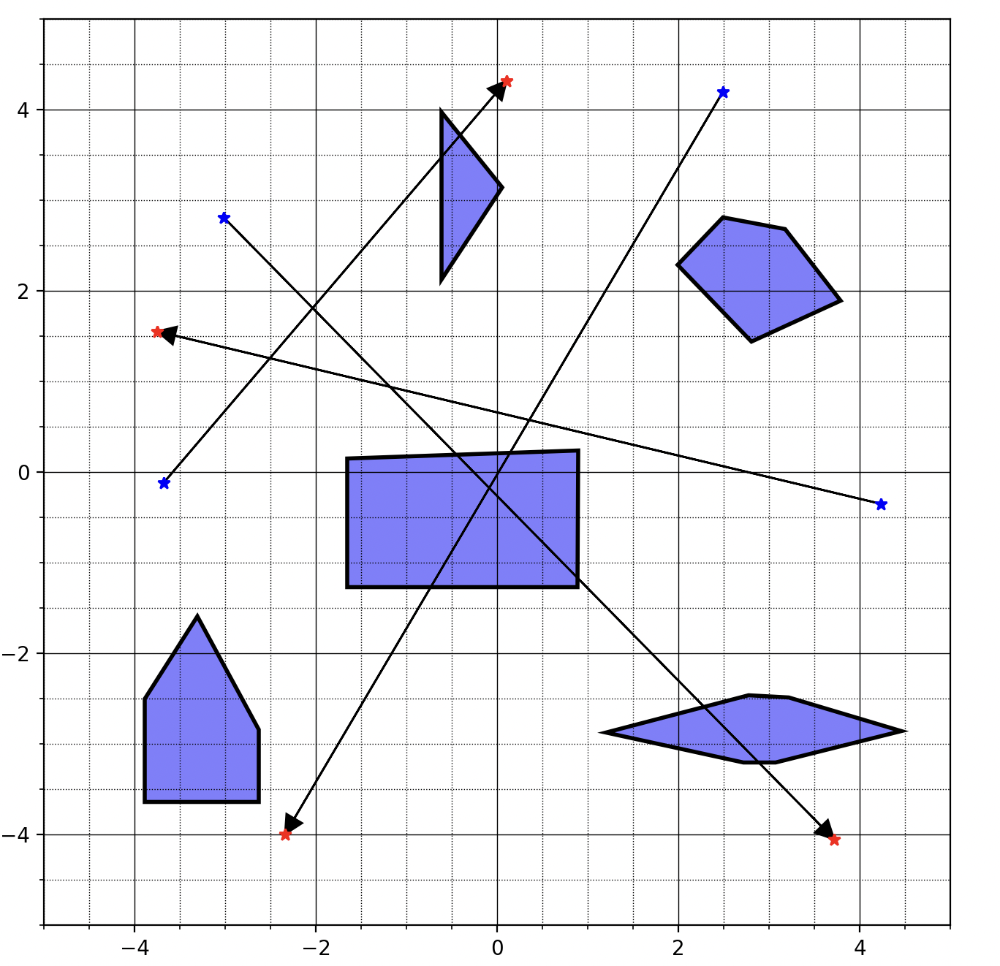
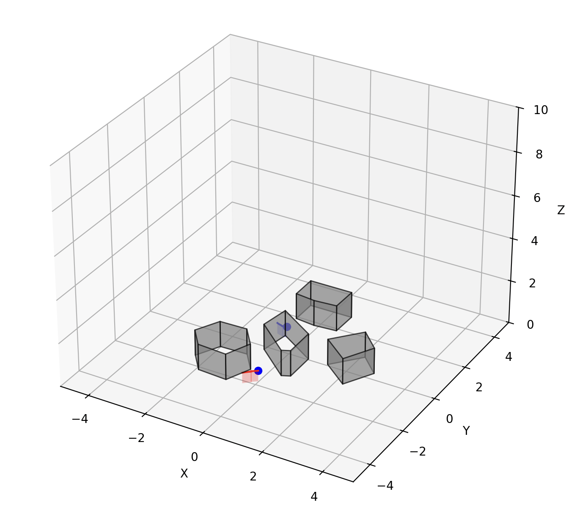

# FLightHouse
### A python development framework for multi-agent path planning.
---
3 parts
## 1. Scenebuilder
**github**: https://github.com/enac-drones/scenebuilder

## 3. Visualisers

  
  
  

