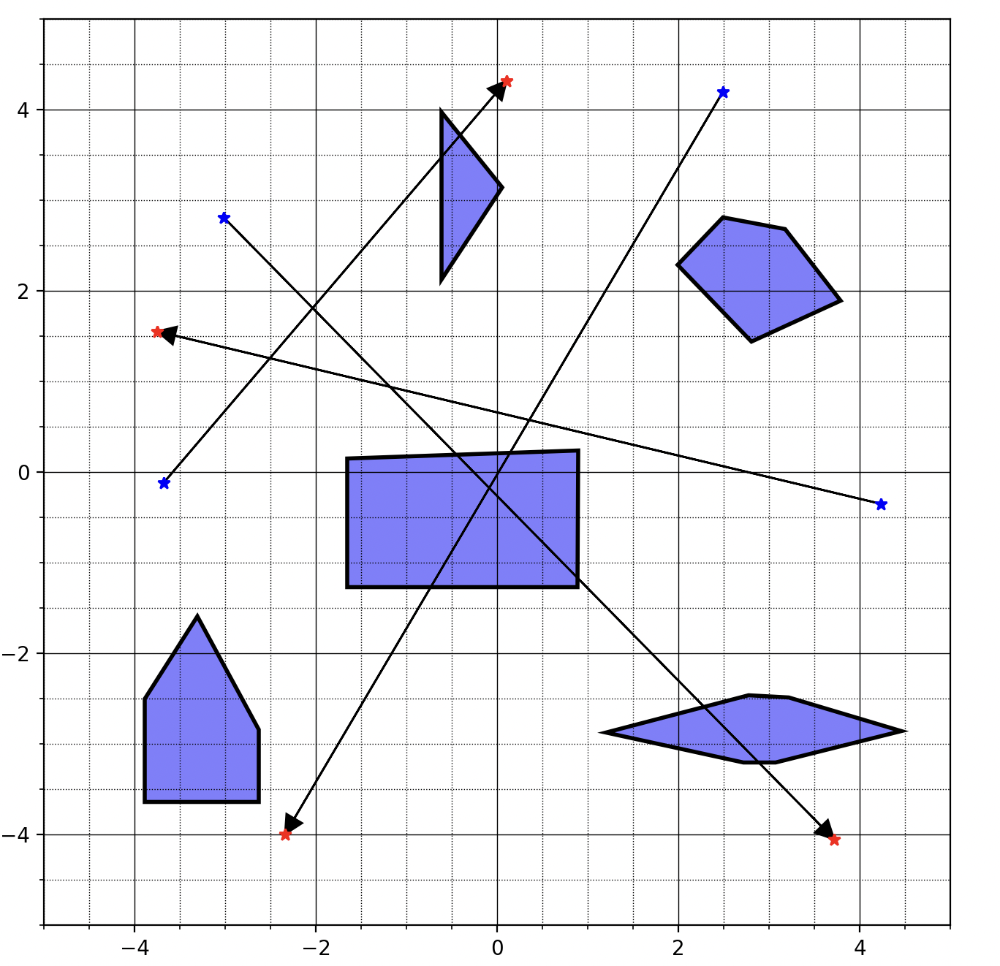
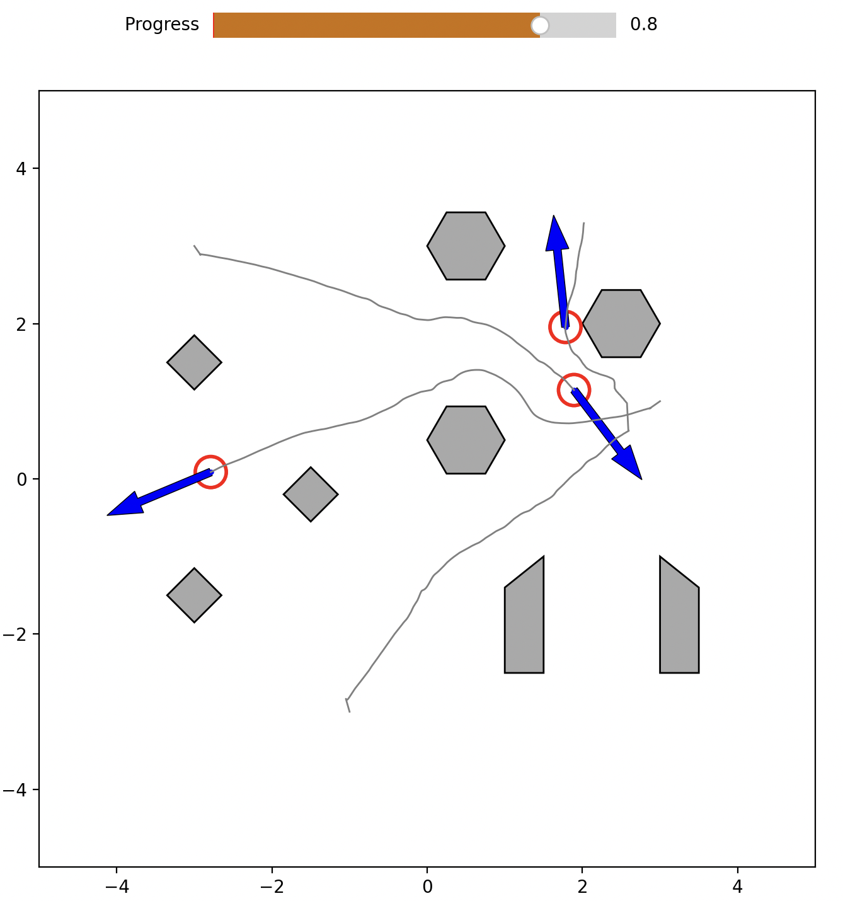
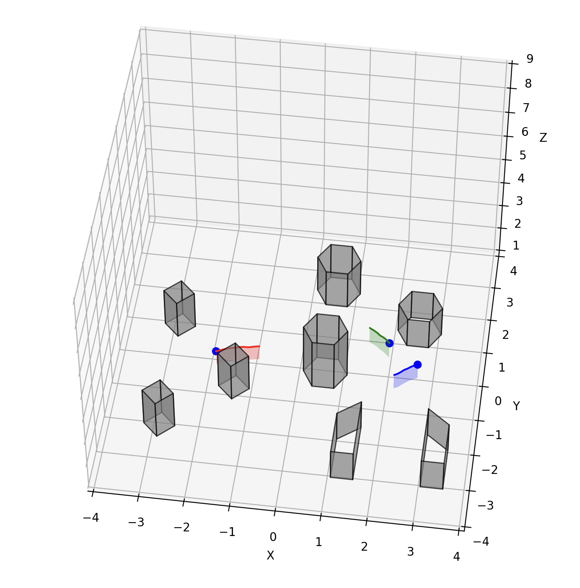
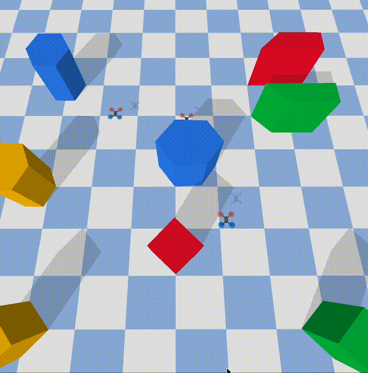

# FLightHouse
### A python development framework for multi-agent path planning.
---
## Installation

From source:

`git clone git@github.com:enac-drones/flighthouse.git`

`cd flighthouse`

Install dependencies to your virtual environment

`pip install -e .`

#### Now go to the examples and have fun!
### Note the main ReadMe is still a work in progress. Each example directory has its own readme with explanations of how to run the code.
## 1. Scenebuilder
**github**: https://github.com/enac-drones/scenebuilder

## 3. Visualisers

  
  
  

