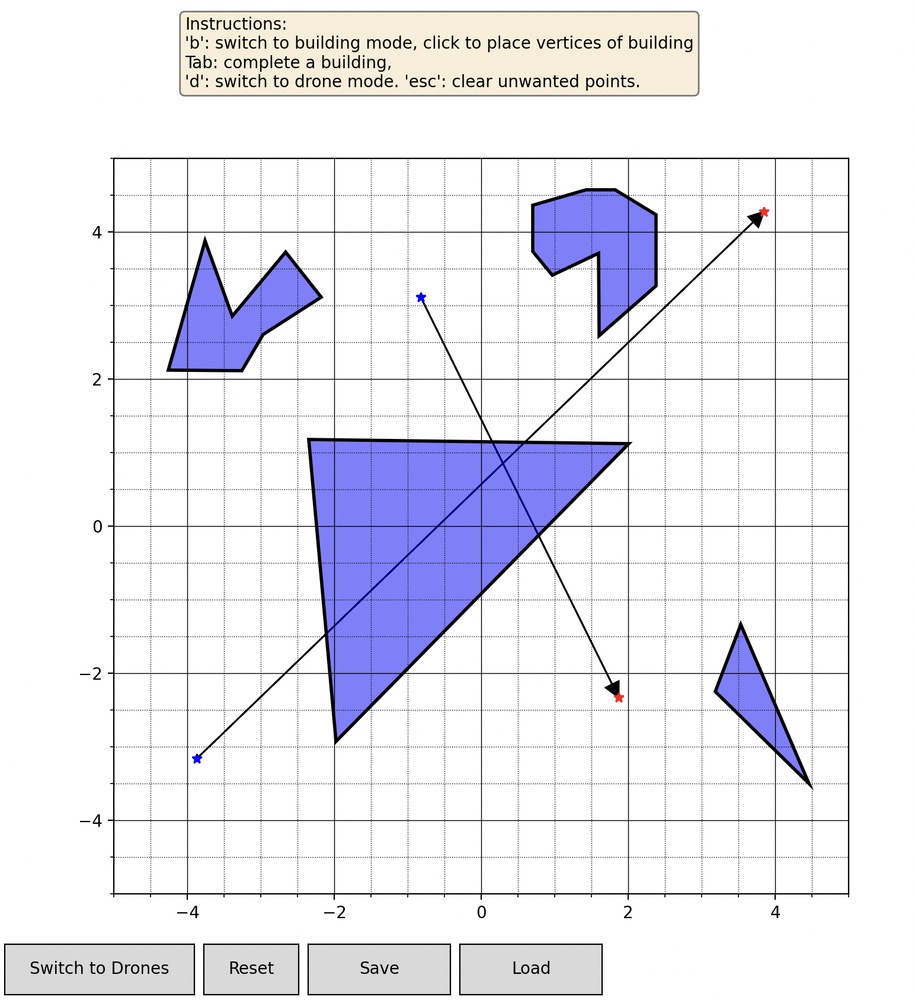

# SceneBuilder Demo
### For a full readme, see here: https://github.com/enac-drones/scenebuilder

#### 3 python modules are provided to demonstrate how to launch SceneBuilder in code.
- ***1-basic_demo.py***: The simplest way to launch scenebuilder without any options.
- ***2-set_new_limits.py***: Set new limits for the square arena by default it is from (-5,-5) to (5,5).
- ***3-load_file.py***: Load an existing JSON file into SceneBuilder.

#### You can also launch SceneBuilder from the command line:
- type "scenebuilder" to launch the gui with no options.
- "scenebuilder -h" or "scenebuilder --help" for more options.

